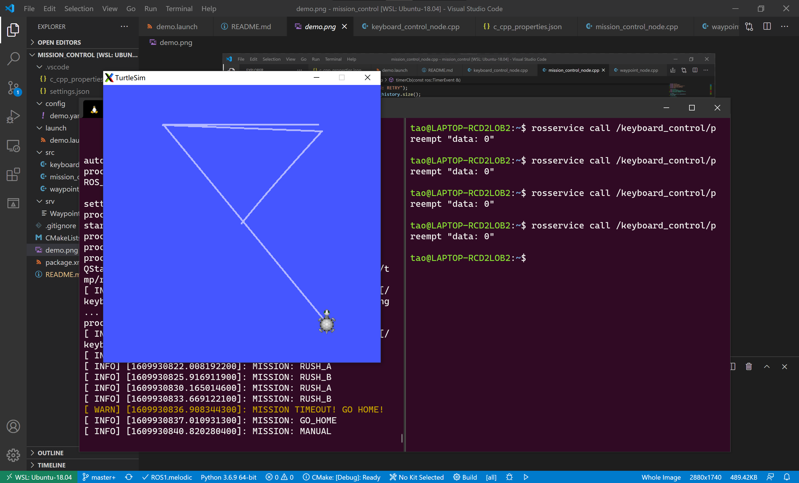

# 任务状态机

## 介绍
基于actionlite实现的状态机例程
## 编译
```Bash
$ cd ~/catkin_ws/src
$ git clone https://gitee.com/harbin-institute-of-technology-csc/actionlite.git
$ git clone https://gitee.com/harbin-institute-of-technology-csc/mission_control.git
$ cd ~/catkin_ws
$ catkin_make
```
## 运行结果
```Bash
$ roslaunch mission_control demo.launch
$ rosservice call /keyboard_control/preempt "data: 0"
```

